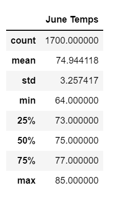
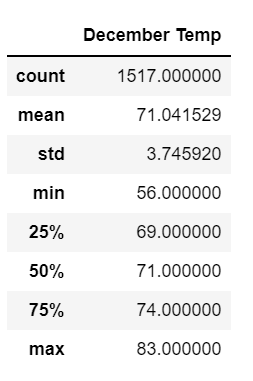
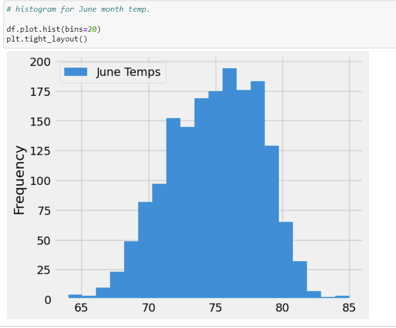
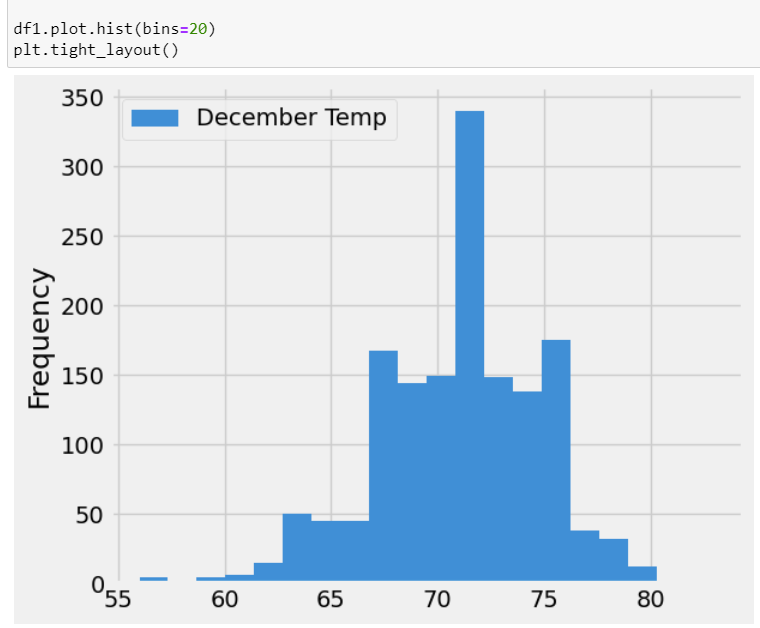

# surfs_up - Analysis

## 1. Overview of the analysis: 
    We would like to start new business of Surf Board which is one of the my passion & Ice Creame at Hawaii. This need high investment and needs some investors to invest in this new business. Mr. Avy who has interest in this businees and needs some data analysis to see if this business can run smoothly with good location where can gain more business prospective. As well as shop location will sustainable year-round

## 2. Results:
    a. First we have obtained the June month temperature results with statistics.

    b. Second we have also obtaind the December month temperture results with statistics.

    c. June month has 183 more dataset for tempeurate with compare to December month temp. data.

    d. June month has 4 degree higher average temp with compare to December month average temp.

    e. December month has higher standard deviation 3.75 with compare to June month 
    3.26 standard devation which shows more tempeature variation in December month.

    f. Decemer month has lower minimum tempeature ( 56 degree) with compare to June month's minimum temp.

##  3. Summary:

    It is observed that June and December month average temperature difference is witin a 4 degree.

    We can refer following Histogram for June and December months,

 - December month's min tempearture is connected with the other data and shows high probability of outlier datapoint.

 - December month's has more variation in temperature with compare to June month's temp. data. 

 - As per data analysis it show that "Oahu" place is the good place to start Surf and business.